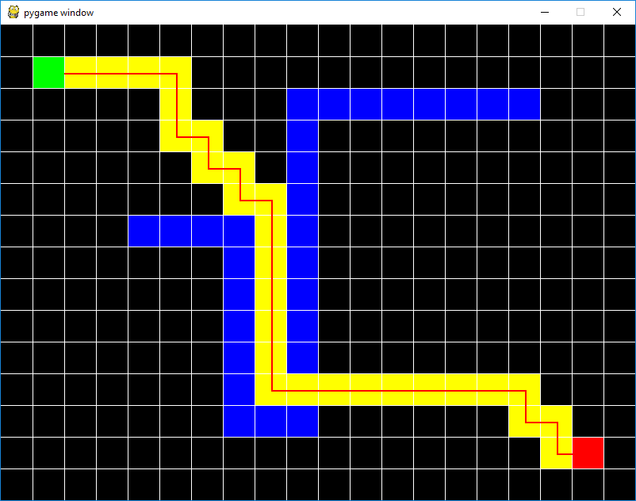
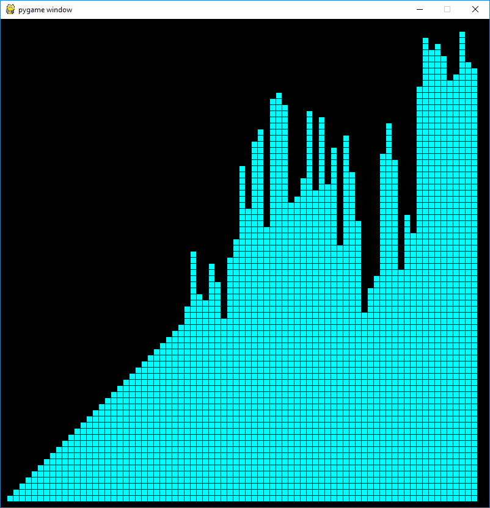
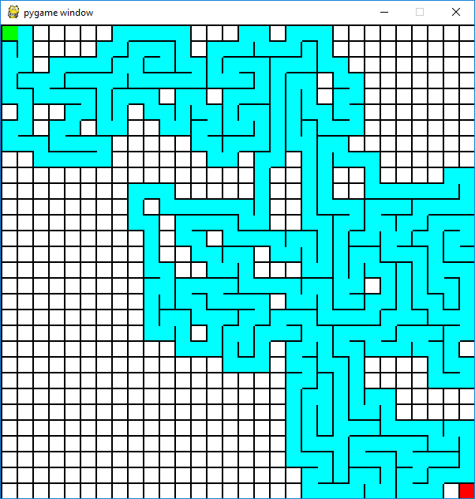
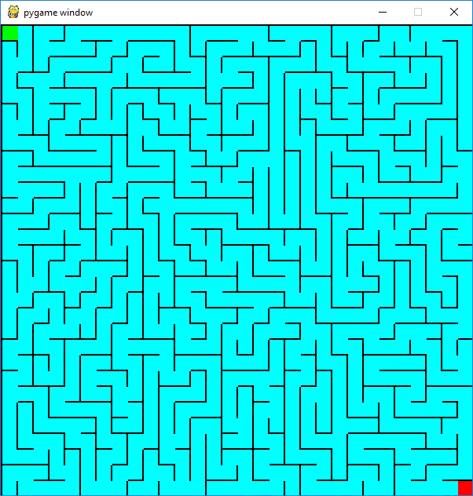

# pygame_scripts
Various PyGame Scripts

## astar_search.py

This is a simple implementation of the A* algorithm on a grid. Barriers (in blue) can be added or removed by clicking.

## sorting.py

Sort visualizer

## maze.py

Maze generator

